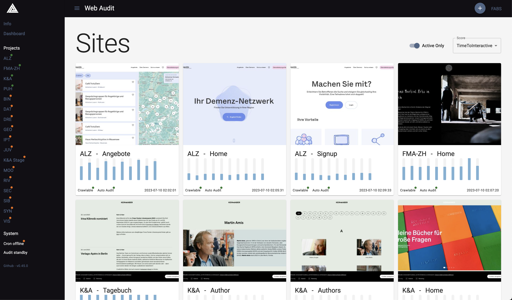
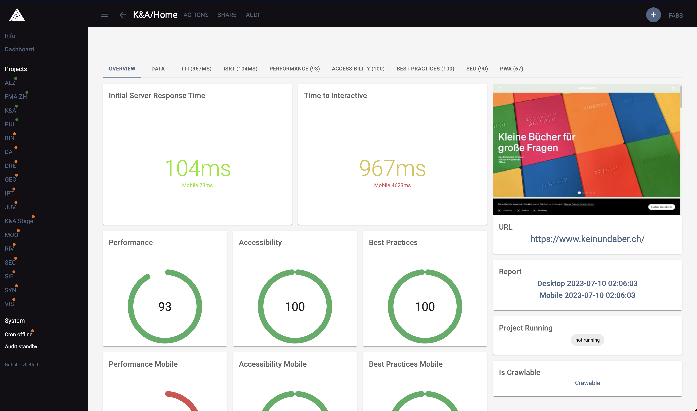

# web-audit

[](https://app.codacy.com/gh/faebeee/lighthouse-inspector/dashboard?utm_source=gh&utm_medium=referral&utm_content=&utm_campaign=Badge_grade)

Web Audit is a tool to automatically audit your web projects. Currently lighthouse is used under the hood.
More integrations are coming




## Requires
This uses a `postgres` database and a `minio` asset bucket.

## Docker
- [DockerHub web-audit-web](https://hub.docker.com/r/faebeee/web-audit-web/tags)
- [DockerHub web-audit-cron](https://hub.docker.com/r/faebeee/web-audit-cron/tags)

### Start docker
```shell
docker run --env-file .env -p PORT:3000 -e "NEXTAUTH_URL=http://localhost:PORT" --name web-audit-web faebeee/web-audit-web:latest
```

### Update docker
```shell
docker stop web-audit-web
docker rm web-audit-web
docker rmi faebeee/web-audit-web:latest
docker pull faebeee/web-audit-web:latest
```
and then reuse the command from `Start docker`

## Docker-compose
Run `docker-compose up`

Then run `npm run cli:create-user` which will create a new `admin` user with the password `admin`


## Dev environment
Start the `minio` and `postgres` container with

- `docker-compose up database`
- `docker-compose up minio`
- `npx prisma migrate dev`
- Go to localhost:9001 and create a new bucket and add the credentials to the env (see below)
- `npm run build`
- `npm run start`

## Env variables

```dotenv
NEXTAUTH_URL=http://localhost:3000
NEXTAUTH_SECRET=***
DATABASE_URL=***
MINIO_HOST=***
MINIO_BUCKET=***
MINIO_ACCESS_KEY=***
MINIO_SECRET_KEY=***
```

## THEME config
Set the env var `NEXT_PUBLIC_THEME_MODE` to `dark` or `light`
